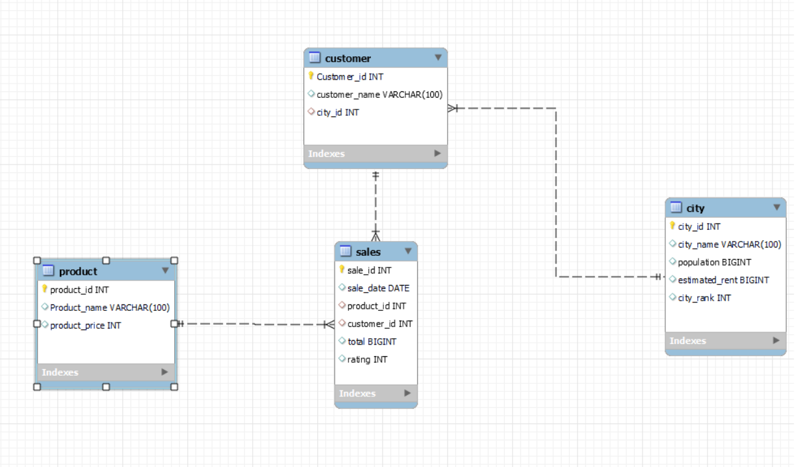

# Coffee Shop Sales Analysis Project

## Overview

This project is a **Coffee Shop Sales Analysis** system built using MySQL. It includes database schema creation, data loading, and a series of queries to analyze and gain insights into the sales performance, customer behavior, and product popularity.

---

## Files in the Project

1. **`Creating Tables & Loading Data.sql`**  
   - Creates the **Coffee Shop Sales Analysis** database.  
   - Defines the database schema by creating tables:  
     - `city`, `customer`, `product`, and `sales`.  
   - Loads data into the tables from CSV files.

2. **`EDA Queries.sql`**  
   - Contains SQL queries for performing exploratory data analysis (EDA), including:  
     - **Sales Analysis**: Total revenue, product sales trends, and city-specific sales performance.  
     - **Customer Insights**: Identifying top customers and sales distribution by city.  
     - **Product Performance**: Most popular products and revenue breakdown by product.  

3. **Data Files (CSV)**  
   - **`city.csv`**: Contains data about cities where coffee shops are located.  
   - **`customers.csv`**: Contains customer details and their associated cities.  
   - **`products.csv`**: Contains coffee product details and pricing.  
   - **`sales.csv`**: Captures transaction-level sales data.

---

## Database Schema

Below is the schema diagram representing the structure of the Coffee Shop Sales Analysis system:



---

## Key Functionalities

- **Analyze Sales Trends**: Understand revenue generation over time and identify peak sales periods.  
- **Customer Insights**:  
  - Analyze purchasing behavior by city.  
  - Identify the top-performing customers.  
- **Product Performance Analysis**:  
  - Identify the most popular products.  
  - Calculate revenue contribution from each product.  
- **City Performance**: Evaluate city-wise sales performance and coffee consumption patterns.  

---
## Creating Tables & Loading Data into tables

### 1. Creating Database and Tables 
```sql
CREATE DATABASE coffee_shop;
USE Coffee_shop;


CREATE TABLE city(
	city_id int PRIMARY KEY,
    city_name VARCHAR(100),
    population BIGINT,
    estimated_rent BIGINT,
    city_rank INT);
    
    
CREATE TABLE Customer(
	Customer_id INT PRIMARY KEY,
    customer_name VARCHAR(100), 
    city_id INT,
    FOREIGN KEY (city_id) REFERENCES city (city_id));
    
    
CREATE TABLE Product(
	product_id INT PRIMARY KEY,
    Product_name VARCHAR(100),
    product_price INT);
    

CREATE TABLE Sales(
	sale_id INT PRIMARY KEY,
    sale_date DATE,
    product_id INT,
    customer_id INT, 
    total INT, 
    rating INT,
    FOREIGN KEY (product_id) REFERENCES product (product_id),
    FOREIGN KEY (customer_id) REFERENCES customer (customer_id));
```

### 2. Loading Data from csv file into Tables 
```mysql
-- Enabling loading data into the files.
SET GLOBAL local_infile=ON;   


-- Loading Data into City Table.
LOAD DATA LOCAL INFILE "D:/Projects/MySQL/8 - Monday Coffee/city.csv"
INTO TABLE city
FIELDS TERMINATED BY ","
ENCLOSED BY '"'
LINES TERMINATED BY "\r\n"
IGNORE 1 ROWS ;
    
    
-- Loading Data into Customer Table.
LOAD DATA LOCAL INFILE "D:/Projects/MySQL/8 - Monday Coffee/customers.csv"
INTO TABLE customer
FIELDS TERMINATED BY ","
ENCLOSED BY '"'
LINES TERMINATED BY "\r\n"
IGNORE 1 ROWS ;


-- Loading Data into Product Table.
LOAD DATA LOCAL INFILE "D:/Projects/MySQL/8 - Monday Coffee/products.csv"
INTO TABLE product
FIELDS TERMINATED BY ","
ENCLOSED BY '"'
LINES TERMINATED BY "\r\n"
IGNORE 1 ROWS ;


-- Loading Data into Sales Table.
LOAD DATA LOCAL INFILE "D:/Projects/MySQL/8 - Monday Coffee/sales.csv"
INTO TABLE sales
FIELDS TERMINATED BY ","
ENCLOSED BY '"'
LINES TERMINATED BY "\r\n"
IGNORE 1 ROWS ;
```

## Exploratory Data Analysis (EDA) Queries
### 1. How many people in each city are estimated to consume coffee from the shope?
```sql
WITH customer_city AS (
SELECT DISTINCT
	s.customer_id,
    cty.city_name
FROM
	sales AS s
INNER JOIN
	customer AS cust
ON
	s.customer_id = cust.customer_id
LEFT JOIN
	city AS cty
ON
	cty.city_id = cust.city_id)

SELECT
	city_name,
    CONCAT(ROUND(COUNT(customer_id) / (SELECT COUNT(*) FROM customer_city) * 100, 2), "%") AS coffee_perc
FROM
	customer_city
GROUP BY 
	city_name;
```

### 2. What is the total revenue generated from coffee sales across all cities in the last quarter of 2023?
```sql
WITH city_revenue AS (
SELECT
	cty.city_name,
	s.sale_date,
    s.total,
    s.customer_id
FROM
	sales AS s
LEFT JOIN
	customer AS cust
ON
	cust.customer_id = s.customer_id
LEFT JOIN
	city AS cty
ON
	cty.city_id = cust.city_id
WHERE
	YEAR(s.sale_date) = 2023
    AND QUARTER(s.sale_date) = 4)

SELECT
	city_name,
    QUARTER(s.sale_date) AS qurat,
    CONCAT(FORMAT(SUM(total), 0), " $") AS Total_Revenue
FROM
	city_revenue
GROUP BY 
	city_name, QUARTER(s.sale_date)
ORDER BY SUM(total) DESC;
```

### 3. What is the average sales amount per customer in each city?
```sql
WITH avg_customer AS (
SELECT
	customer_id,
    ROUND(AVG(total), 2) AS avg_total
FROM
	sales
GROUP BY 
	customer_id)

SELECT
	cty.city_name,
    avc.customer_id,
    avc.avg_total
FROM
	avg_customer AS avc
LEFT JOIN
	customer AS cust
ON
	cust.customer_id = avc.customer_id
LEFT JOIN
	city AS cty
ON
	cty.city_id = cust.city_id;
```

### 4. How many units of each coffee product have been sold?
```sql
SELECT
	prod.product_name,
    FORMAT(COUNT(s.product_id), 0) AS num_sold
FROM
	sales AS s
LEFT JOIN
	product AS prod
ON
	prod.product_id = s.product_id
GROUP BY	
	prod.product_name
ORDER BY COUNT(s.product_id) DESC;
```

### 5. What are the top 3 selling products in each city based on sales volume?
```sql
WITH city_product AS (
    SELECT
        city.city_name,
        prod.product_name,
        s.total,
        s.customer_id
    FROM
        sales AS s
    LEFT JOIN
        product AS prod
    ON
        prod.product_id = s.product_id
    LEFT JOIN
        customer AS cust
    ON
        cust.customer_id = s.customer_id
    LEFT JOIN
        city
    ON
        city.city_id = cust.city_id
), 
rank_city_product AS (
    SELECT
        city_name,
        product_name,
        SUM(total) AS total_sales,
        ROW_NUMBER() OVER (PARTITION BY city_name ORDER BY SUM(total) DESC) AS row_rank
    FROM	
        city_product
    GROUP BY	
        city_name, product_name
)
SELECT
    *
FROM
    rank_city_product
WHERE
    row_rank <= 3;
```


### 6. How many unique customers are there in each city who have purchased coffee products?
```sql
WITH customer_city AS (
    SELECT DISTINCT
        s.customer_id,
        cty.city_name
    FROM
        sales AS s
    INNER JOIN
        customer AS cust
    ON
        s.customer_id = cust.customer_id
    LEFT JOIN
        city AS cty
    ON
        cty.city_id = cust.city_id
)
SELECT
    city_name,
    COUNT(customer_id) AS num_customer
FROM
    customer_city
GROUP BY 
    city_name;
```

### 7. Find each city and their average sale per customer and avg rent per customer
```sql
WITH city_avg AS (
    SELECT
        city.city_name,
        city.estimated_rent,
        cust.customer_id,
        s.total
    FROM
        city
    LEFT JOIN
        customer AS cust
    ON
        cust.city_id = city.city_id
    LEFT JOIN
        sales AS s
    ON
        s.customer_id = cust.customer_id
)
SELECT
    city_name,
    FORMAT(AVG(estimated_rent), 0) AS avg_rent,
    FORMAT(AVG(total), 0) AS avg_total
FROM
    city_avg
GROUP BY    
    city_name;
```

### 8. Calculate the percentage growth in sales over different time periods (monthly) by each city.
```sql
WITH growth_city AS (
    SELECT
        city.city_name,
        YEAR(s.sale_date) AS year,
        MONTH(s.sale_date) AS month,
        SUM(s.total) AS Revenue,
        LAG(SUM(s.total)) OVER (PARTITION BY city.city_name, YEAR(s.sale_date) ORDER BY YEAR(s.sale_date), MONTH(s.sale_date)) AS last_revenue
    FROM
        sales AS s
    LEFT JOIN
        customer AS cust
    ON
        cust.customer_id = s.customer_id
    LEFT JOIN
        city
    ON
        city.city_id = cust.city_id
    GROUP BY
        1, 2, 3
    ORDER BY 
        1, 2, 3
)
SELECT
    *, 
    IFNULL(
        CONCAT(
            ROUND(
                (revenue - last_revenue) / last_revenue * 100, 2
            ), "%"
        ), 0) AS growth_rate
FROM
    growth_city;
```

### 9. Identify top 3 city based on highest sales, return city name, total sale, total rent, total customers, estimated coffee consumer
```sql
SELECT
    city.city_name,
    FORMAT(SUM(s.total), 0) AS total_sales,
    FORMAT(COUNT(s.customer_id), 0) AS num_customer,
    FORMAT(AVG(city.estimated_rent), 0) AS avg_rent
FROM
    sales AS s
LEFT JOIN
    customer AS cust
ON
    cust.customer_id = s.customer_id
RIGHT JOIN
    city
ON
    city.city_id = cust.city_id
GROUP BY    
    city.city_name
ORDER BY
    SUM(s.total) DESC
LIMIT 3;
```


## Tools Used

- **Database**: MySQL  
- **Data Files**: CSV files containing sample sales, product, customer, and city data  

---

## Usage Instructions

1. Run `Creating Tables & Loading Data.sql` to create the database schema and load the data into the tables.  
2. Execute `EDA Queries.sql` to analyze the data and gain insights using the pre-written SQL queries.  

---

## Contact

For any queries or suggestions, feel free to reach out:  
**Bahaa Medhat Wanas**  
- LinkedIn: [Bahaa Wanas](https://www.linkedin.com/in/bahaa-wanas-9797b923a)  
- Email: [bahaawanas427@gmail.com](mailto:bahaawanas427@gmail.com)
